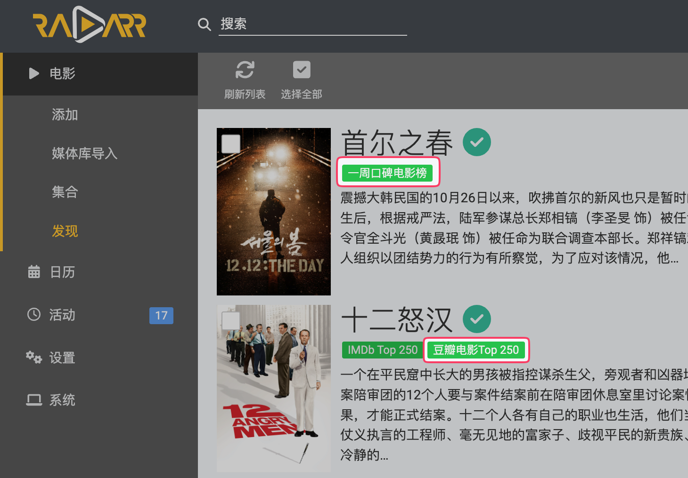

# Doudarr: 将豆瓣榜单/片单/豆列转换为Radarr列表

## 介绍

Doudarr是一个将豆瓣榜单/片单/豆列（以下统称`豆瓣列表`）转换为Radarr列表的工具。它可以将任意豆瓣列表中的电影列表转换为Radarr列表，从而实现自动监控豆瓣列表中的电影，并自动下载。

## 使用

1. 使用Docker部署Doudarr: `docker run -d --name doudarr -p 8000:8000 -v /path/to/cache:/app/cache kfstorm/doudarr:latest`。可配置的参数参见[Doudar服务参数](#doudarr服务参数)。

2. 访问[http://localhost:8000/collection/movie_weekly_best](http://localhost:8000/collection/movie_weekly_best)，测试是否能够获取到该豆瓣列表中的电影列表。(对应的豆瓣网页为[https://m.douban.com/subject_collection/movie_weekly_best](https://m.douban.com/subject_collection/movie_weekly_best)。)

3. 进入Radarr，在`设置 -> 列表`中新增一个列表，选择`Advanced List`中的`StevenLu Custom`，设置好参数后保存。一些常用参数：

* 名称: 可以和豆瓣列表的名字一样，方便记忆。
* 启用自动添加：打开后会自动添加豆瓣列表里的电影到库中。（建议打开）
* 添加时搜索：打开后在添加电影到库中时会自动开始搜索下载。（建议打开）
* URL: 填写完整的Doudarr链接。（请参考[豆瓣列表链接与Doudarr链接的映射关系](#豆瓣列表链接与doudarr链接的映射关系)）

4. 片刻后，应该能看到Radarr自动添加了豆瓣列表中的电影。也可以在Radarr的`电影 -> 发现`中查看。（右上角`选项`里取消勾选`包含Radarr推荐`，右上角`过滤`里选择`全部`。）

## Doudarr服务参数

Doudarr服务支持以环境变量的方式配置服务参数。参数列表如下：

<!-- DOUDARR_SERVICE_PARAMETERS_START -->

| 环境变量 | 默认值 | 说明 |
| --- | --- | --- |
| `DOUDARR_CACHE_BASE_DIR` | `cache` | 缓存路径。默认值为相对路径，也可以填写绝对路径。 |
| `DOUDARR_DOUBAN_API_REQUEST_DELAY_MAX_SECONDS` | `1` | 请求豆瓣API时的最大延迟（秒）。两次请求之间的延迟是随机的，这里配置的是最大值。 |
| `DOUDARR_LIST_CACHE_TTL_SECONDS` | `86400` | 列表缓存的TTL（秒）。列表缓存会在一段时间后过期，过期后会重新抓取。如果豆瓣列表的条目有更新，重新抓取后会拿到最新的条目。 |
| `DOUDARR_IMDB_REQUEST_DELAY_MAX_SECONDS` | `30` | 抓取IMDb信息时的最大延迟（秒）。两次请求之间的延迟是随机的，这里配置的是最大值。 |
| `DOUDARR_IMDB_CACHE_TTL_ID_NOT_FOUND_SECONDS` | `2592000` | IMDb ID未找到时的缓存TTL（秒）。部分豆瓣条目没有IMDb ID（可能是暂时的），没有找到时会缓存一段时间，避免重复查询。TTL到期后会再次查询。 |
| `DOUDARR_PROXY_ADDRESS` | 无 | 代理地址，所有HTTP请求将通过代理转发。 |
| `DOUDARR_ENABLE_BOOTSTRAP` | `True` | 是否启用缓存预热。 |
| `DOUDARR_BOOTSTRAP_INTERVAL_SECONDS` | `86400` | 缓存预热的时间间隔（秒）。缓存预热会在后台定期执行，用于抓取IMDb信息并缓存，加快后续查询速度。设置间隔可以避免短时间内抓取太多信息，导致访问受限。 |
| `DOUDARR_BOOTSTRAP_LIST_INTERVAL_SECONDS` | `30` | 缓存预热时抓取两个列表之间的时间间隔（秒）。设置间隔可以避免短时间内抓取太多列表，导致访问受限。 |
| `DOUDARR_BOOTSTRAP_LISTS_MAX` | `100` | 缓存预热时抓取的列表最大数量。每次缓存预热只会抓取部分列表，这个值越大，抓取的列表数量越多，IMDb信息的预热越充分。 |
| `DOUDARR_DOUBAN_RATE_LIMIT_DELAY_SECONDS` | `3600` | 豆瓣API的速率限制延迟（秒）。当遇到豆瓣API返回访问限制时，在配置的时间范围内不再请求豆瓣API，避免访问受限更严重。 |
| `DOUDARR_APIKEY` | 无 | API密钥。API密钥用于对外提供访问权限，部分API只有在提供了正确的API密钥时才能访问，例如`/sync` API。 |
| `DOUDARR_SYNC_IMDB_CACHE_INTERVAL_SECONDS` | `3600` | 同步IMDb缓存到其他Doudarr实例的时间间隔（秒）。同步IMDb缓存会定期将缓存同步到其他Doudarr实例上，以便多个Doudarr实例之间共享IMDb缓存。 |
| `DOUDARR_SYNC_IMDB_CACHE_TO` | `[]` | 同步IMDb缓存到其他Doudarr实例的URL列表。同步IMDb缓存会定期将缓存同步到其他Doudarr实例上，以便多个Doudarr实例之间共享IMDb缓存。该参数可以包括多个URL，用于同步到多个Doudarr实例。参数示例：`["http://doudarr-another-1:8000/sync?apikey=another-apikey-1", "http://doudarr-another-2:8000/sync?apikey=another-apikey-2"]`。注意这里的apikey需要填写对应实例的apikey，而不是自己的。该参数的值较为复杂，配置环境变量时注意转义。 |
| `DOUDARR_COOKIE_DOUBAN_COM_DBCL2` | 无 | 豆瓣网站的cookie中key为`dbcl2` cookie的值。如果想让Doudarr以登录用户的身份去访问豆瓣的接口，请配置该参数。 |
| `DOUDARR_DOUBAN_IDATABASE_URL` | 无 | 豆瓣数据库 API的基础URL（例如：http://localhost:8000）。如果配置了此参数，IMDb ID查询将使用此API，而不是抓取豆瓣网页。 |
| `DOUDARR_DOUBAN_IDATABASE_API_KEY` | 无 | 豆瓣数据库 API的密钥（可选）。如果服务器允许匿名访问，可以留空。 |
| `DOUDARR_DOUBAN_IDATABASE_TIMEOUT_SECONDS` | `10` | 调用豆瓣数据库 API的超时时间（秒）。 |

<!-- DOUDARR_SERVICE_PARAMETERS_END -->

## 豆瓣列表链接与Doudarr链接的映射关系

豆瓣列表的链接有两种格式，请根据情况选择对应的Doudarr链接。

| 豆瓣列表链接格式 | Doudarr链接格式 | Doudarr链接示例 |
| --- | --- | --- |
| `https://m.douban.com/subject_collection/<豆瓣列表ID>` | `http://<Doudarr服务地址>/collection/<豆瓣列表ID>` | `http://localhost:8000/collection/movie_weekly_best` |
| `https://www.douban.com/doulist/<豆瓣列表ID>/` | `http://<Doudarr服务地址>/doulist/<豆瓣列表ID>` | `http://localhost:8000/doulist/43556565` |

## URL参数

可以通过额外的query参数来控制返回的内容。

| 参数 | 说明 | 示例 |
| --- | --- | --- |
| `min_rating` | 最低评分要求。只有不低于指定评分的电影才会被返回。 | `http://localhost:8000/collection/movie_weekly_best?min_rating=8` |

## 注意事项

* 因为豆瓣的反爬策略，Doudarr限制了请求频率。首次启动Doudarr时，API请求较慢，需耐心等待。
* 记得将容器内的`/app/cache`目录映射到宿主机上，以免后续容器重建或升级时丢失缓存数据。

## 公共服务地址

为了方便大家使用，可以使用公共的Doudarr服务：[https://doudarr.kfstorm.com](https://doudarr.kfstorm.com)。公共服务的IMDb ID缓存可能更全面，可以更快加载出豆瓣列表中的电影。

请注意，这是一个公共服务，不保证稳定性和可用性。如果有条件，建议自行部署Doudarr。

### 豆瓣数据库 API

如果你不想让 Doudarr 抓取豆瓣网页（容易触发反爬），可以使用 `DOUDARR_DOUBAN_IDATABASE_URL` 参数配置豆瓣数据库 API。

你可以使用公共的免费 API：`https://douban-idatabase.kfstorm.com`（不保证在线率），或者自行部署兼容该接口的服务。

该 API 的接口规范请参考：[自建豆瓣数据库 API 要求](https://github.com/kfstorm/douban-rating-arr#%E8%87%AA%E5%BB%BA%E8%B1%86%E7%93%A3%E6%95%B0%E6%8D%AE%E5%BA%93-api-%E8%A6%81%E6%B1%82)。

## 项目特色

* 支持任意豆瓣列表。
* 使用IMDb ID作为电影的唯一标识，不会因为电影名字相近而导致添加错误的电影。

## FAQ

* 如何找到喜欢的豆瓣列表？

  * 在豆瓣手机App中，依次选择`书影音 -> 电影 -> 豆瓣榜单`，可以浏览所有的榜单/片单（也叫豆列）。选择一个想要监控的豆瓣列表，点击进入，然后打开分享菜单，选择`复制链接`，即可获得该豆瓣列表的URL。
  * 使用Google搜索`site:douban.com/subject_collection`或`site:douban.com/doulist`。
  * [关于电影的豆列](https://www.douban.com/tag/%E7%94%B5%E5%BD%B1/doulist)。

## TODO

下面是我想到的可能会做的功能，但不一定会实现。欢迎提出新的功能需求。

* [x] 支持在列表上增加筛选逻辑，如最低评分要求。
* [ ] 支持以导演、演员为ID创建列表。
